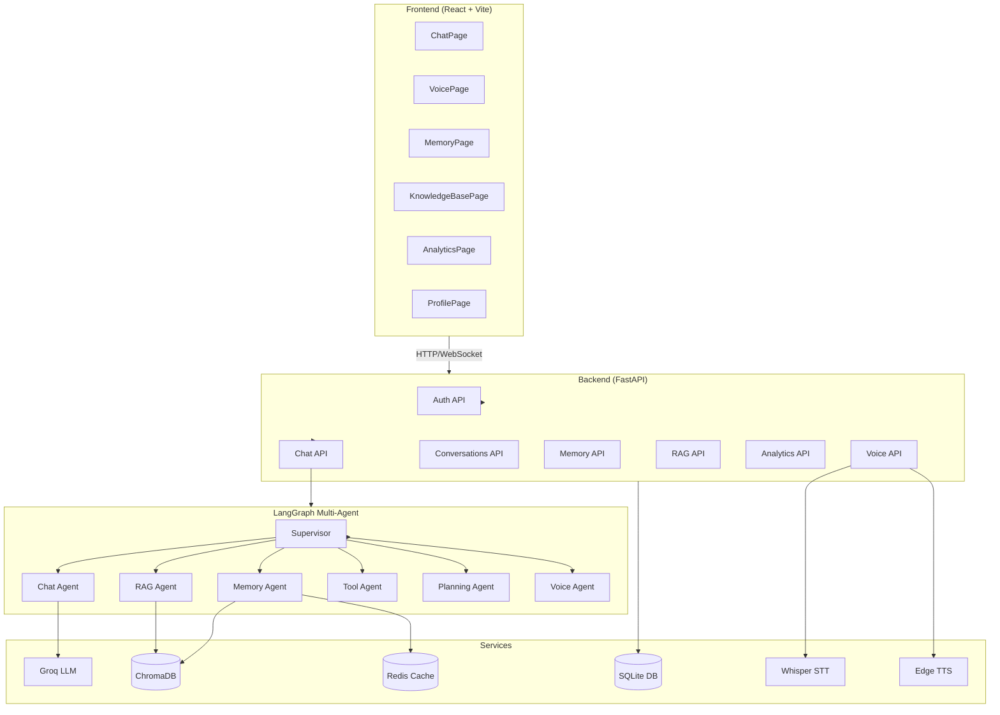

# NovaAI

NovaAI is a full-stack enterprise AI assistant featuring multi-agent orchestration, persistent memory, voice interaction, and retrieval-augmented generation — built with modern AI technologies and a responsive React frontend.

## Features

- **Conversational AI** — Powered by Groq LLM (Llama 3.3 70B) with LangGraph multi-agent orchestration
- **7 Specialized Agents** — Supervisor, Chat, Memory, RAG, Tool, Planning, and Voice agents
- **8 Built-in Tools** — Calculator, DateTime, Weather, Search, Password Generator, OTP Generator, UUID Generator, Random Integer
- **Long-Term Memory** — ChromaDB vector store with Redis caching and semantic search
- **Voice Assistant** — Speech-to-text (Faster-Whisper) and text-to-speech (Edge TTS)
- **RAG Pipeline** — Upload documents (PDF, DOCX, TXT, MD) and query with semantic retrieval
- **JWT Authentication** — Secure user registration, login, and token refresh
- **Persistent Conversations** — Full conversation history with auto-generated titles
- **Analytics Dashboard** — Chat metrics, tool usage, performance traces, and error logging
- **Docker Deployment** — Production-ready with health checks and volume persistence

## Screenshots

<!-- Add screenshots here -->
<!--  -->
<!--  -->
<!--  -->

## Quick Start (Development)

### Prerequisites

- Python 3.12+
- Node.js 18+
- A [Groq API key](https://console.groq.com/)

### Backend

```bash
cd backend
cp .env.example .env   # Edit .env and add your GROQ_API_KEY
pip install -r requirements.txt
python -m uvicorn main:app --reload --host 0.0.0.0 --port 8000
```

### Frontend

```bash
cd frontend
npm install
npm run dev
```

The frontend runs at `http://localhost:5173` and proxies API requests to the backend at `http://localhost:8000`.

## Quick Start (Docker)

```bash
# Clone the repository
git clone <repo-url> && cd novaai

# Create backend environment file
cp backend/.env.example backend/.env
# Edit backend/.env — set GROQ_API_KEY at minimum

# Start all services
docker compose up -d --build

# With Redis (optional)
docker compose --profile with-redis up -d --build
```

| Service  | URL                |
|----------|--------------------|
| Frontend | http://localhost    |
| Backend  | http://localhost:8000 |
| API Docs | http://localhost:8000/docs |
| Health   | http://localhost:8000/health |

## Environment Variables

### Required

| Variable | Description | Default |
|----------|-------------|---------|
| `GROQ_API_KEY` | Groq API key for LLM inference | — |

### Optional

| Variable | Description | Default |
|----------|-------------|---------|
| `GROQ_MODEL` | Groq model identifier | `llama-3.3-70b-versatile` |
| `GROQ_TEMPERATURE` | LLM temperature | `0.7` |
| `GROQ_MAX_TOKENS` | Max tokens per response | `1024` |
| `DATABASE_URL` | SQLAlchemy database URL | `sqlite+aiosqlite:///./ai_assistant.db` |
| `JWT_SECRET_KEY` | Secret key for JWT signing | `change-me-in-production` |
| `ACCESS_TOKEN_EXPIRE_MINUTES` | Access token TTL (minutes) | `30` |
| `REFRESH_TOKEN_EXPIRE_DAYS` | Refresh token TTL (days) | `7` |
| `REDIS_URL` | Redis connection URL | `redis://localhost:6379/0` |
| `REDIS_USE_FAKE` | Use FakeRedis (in-memory) | `true` |
| `MEMORY_ENABLED` | Enable memory pipeline | `true` |
| `MEMORY_SIMILARITY_THRESHOLD` | Min similarity for memory retrieval | `0.6` |
| `WHISPER_MODEL` | Faster-Whisper model size | `tiny` |
| `TTS_VOICE` | Edge TTS voice | `en-US-GuyNeural` |
| `VOICE_ENABLED` | Enable voice features | `true` |
| `RAG_CHUNK_SIZE` | RAG document chunk size | `800` |
| `RAG_MAX_FILE_SIZE_MB` | Max upload size (MB) | `20` |
| `DEBUG` | Enable debug mode | `False` |

## API Overview

All endpoints are prefixed with `/api`. Authentication requires a `Bearer` token in the `Authorization` header.

| Category | Endpoints | Description |
|----------|-----------|-------------|
| Auth | `POST /auth/register`, `POST /auth/login`, `POST /auth/refresh`, `POST /auth/logout` | User authentication |
| Users | `GET /users/me`, `PUT /users/me` | User profile |
| Chat | `POST /chat` | Send messages to AI |
| Conversations | CRUD on `/conversations` | Manage conversation history |
| Memory | `/memory` — list, search, stats, delete | Long-term memory management |
| Voice | `/voice/transcribe`, `/voice/speak`, `/voice/chat`, `/voice/settings` | Voice interaction |
| RAG | `/rag/upload`, `/rag/documents`, `/rag/query`, `/rag/stats` | Document upload and querying |
| Analytics | `/analytics/overview`, `/analytics/tools`, `/analytics/performance`, `/analytics/traces`, `/analytics/errors` | Usage analytics |

Interactive API documentation is available at `http://localhost:8000/docs` (Swagger UI).

## Tech Stack

### Backend
- **Framework:** FastAPI + Uvicorn
- **LLM:** Groq (Llama 3.3 70B via LangChain)
- **Agent Framework:** LangGraph (7-node multi-agent graph)
- **Vector Store:** ChromaDB + FastEmbed (BAAI/bge-small-en-v1.5)
- **Cache:** Redis / FakeRedis (in-memory fallback)
- **Database:** SQLite (aiosqlite) via SQLAlchemy async ORM
- **Auth:** JWT (python-jose) + bcrypt
- **Voice STT:** Faster-Whisper (tiny model)
- **Voice TTS:** Edge TTS
- **Document Processing:** pypdf, python-docx

### Frontend
- **Framework:** React 18 + Vite
- **Styling:** Tailwind CSS
- **Routing:** React Router v6
- **HTTP Client:** Axios
- **State:** React Context (AuthContext)

### Infrastructure
- **Containerization:** Docker + Docker Compose
- **Optional:** Redis 7 (Alpine)

## Architecture



## License

MIT License — see [LICENSE](LICENSE) for details.
