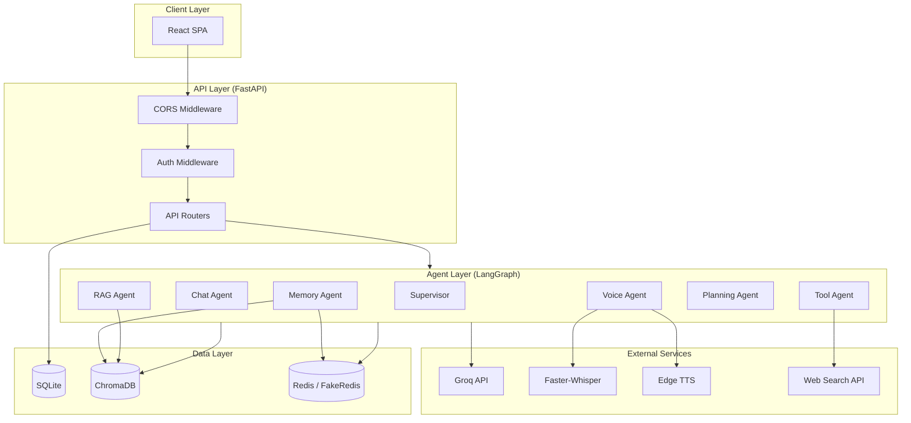
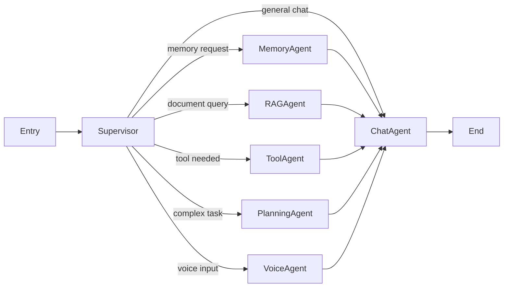
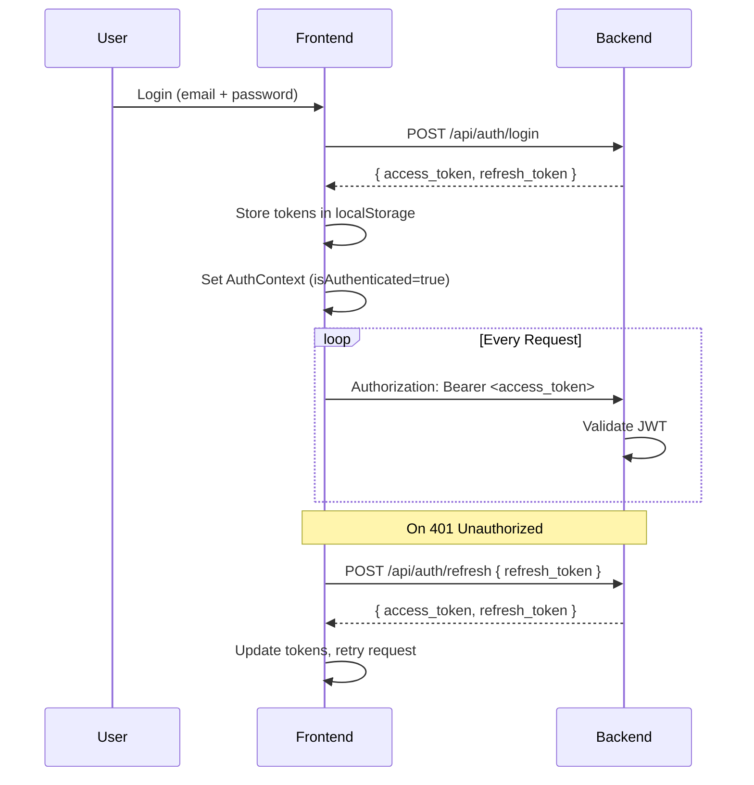
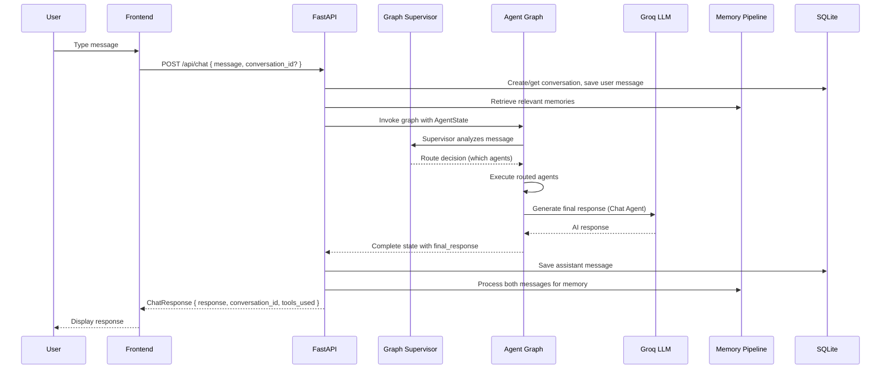
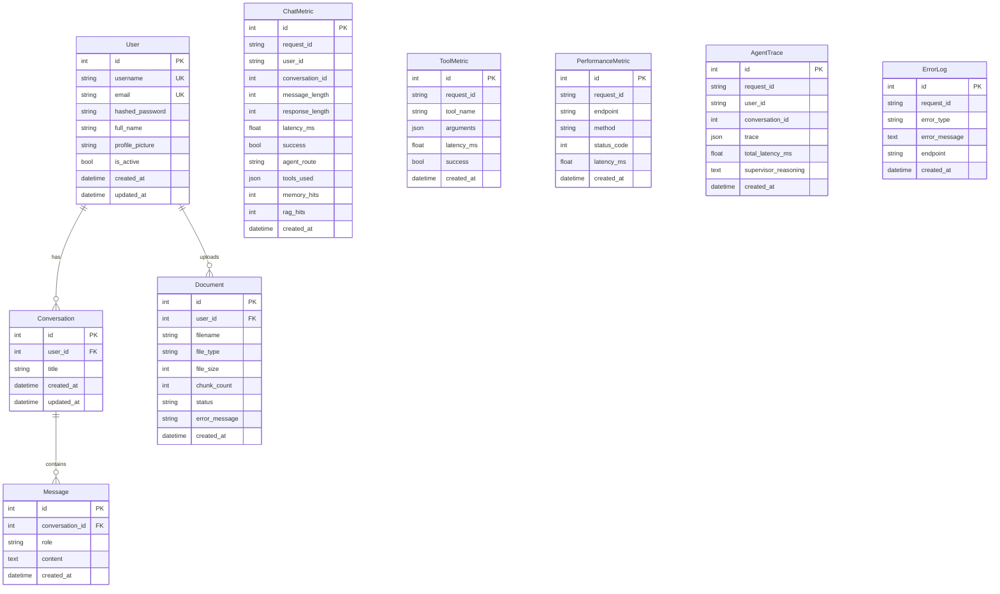
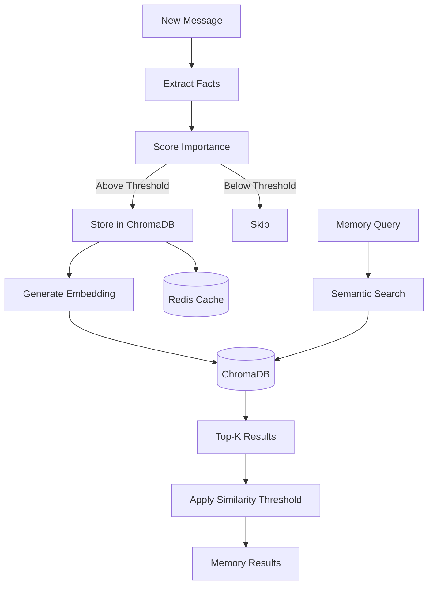
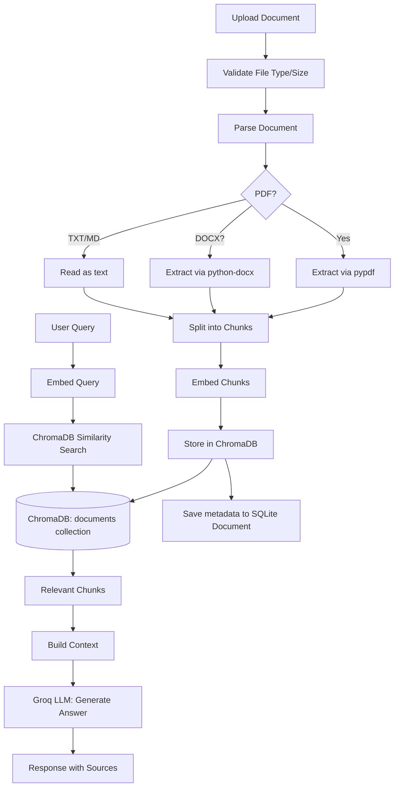

# Architecture

## System Overview

NovaAI follows a multi-tier architecture with a React frontend, FastAPI backend, and a LangGraph multi-agent system for AI processing.



## Backend Architecture

### Project Structure

```
backend/
├── main.py                 # FastAPI application entry point
├── config/settings.py      # Pydantic settings (env vars)
├── database/               # SQLAlchemy async engine, session, base
├── models/                 # ORM models (User, Conversation, Message, Document, Analytics)
├── schemas/                # Pydantic request/response schemas
├── api/                    # REST API routers (auth, chat, conversations, users)
├── auth/                   # JWT token creation/validation
├── agents/                 # 7 LangGraph agent nodes
├── graph/                  # Graph builder, state definition
├── services/               # Business logic (user, conversation, Groq LLM)
├── tools/                  # 8 LangChain tools + tool manager
├── memory/                 # Memory pipeline (manager, Redis service, ChromaDB service)
├── rag/                    # RAG pipeline (manager, document processing)
├── voice/                  # STT (Whisper), TTS (Edge), voice manager
├── analytics/              # Metrics, analytics service, router
├── middleware/              # Request ID, logging middleware
├── utils/                  # Logger, error tracker
└── requirements.txt
```

### Multi-Agent System (LangGraph)

NovaAI uses LangGraph to orchestrate 7 specialized agents in a directed graph:



**State Flow:**
1. User message enters the graph as `AgentState`
2. **Supervisor** analyzes the message via Groq LLM and decides which agents to invoke (can be multiple)
3. Routed agents execute in sequence and enrich the state
4. **Chat Agent** always runs last to generate the final response
5. Graph terminates with `final_response` in state

#### Agent Descriptions

| Agent | Responsibility |
|-------|---------------|
| **Supervisor** | Routes messages to appropriate agents using LLM-based reasoning |
| **Chat Agent** | General conversation, greetings, natural language tasks |
| **Memory Agent** | Retrieves relevant memories from ChromaDB/Redis for context |
| **RAG Agent** | Fetches relevant document chunks from the knowledge base |
| **Tool Agent** | Executes tools (calculator, weather, search, etc.) via LangChain |
| **Planning Agent** | Breaks complex multi-step tasks into ordered plans |
| **Voice Agent** | Processes voice input (STT transcription, TTS response) |

### State Definition

The `AgentState` (TypedDict) carries data through the graph:

```python
class AgentState(TypedDict):
    user_message: str
    user_id: str
    conversation_id: int
    conversation_history: list[dict]
    routed_agents: list[str]
    retrieved_memories: list[dict]
    retrieved_documents: list[dict]
    final_response: str
    metadata: dict
    errors: list[str]
    voice_data: bytes | None
```

### Services

| Service | Purpose |
|---------|---------|
| `groq_service` | LLM inference via Groq API (chat completions, plain chat) |
| `conversation_service` | CRUD for conversations and messages |
| `user_service` | User registration, authentication, profile management |
| `memory_manager` | Orchestrates memory storage, retrieval, and search |
| `redis_service` | Redis cache wrapper with FakeRedis fallback |
| `chroma_service` | ChromaDB vector store operations |
| `rag_manager` | Document ingestion, chunking, embedding, querying |
| `voice_manager` | Full voice chat pipeline (STT → LLM → TTS) |
| `analytics_service` | Records chat metrics, traces, and errors |

## Frontend Architecture

### Project Structure

```
frontend/
├── src/
│   ├── main.jsx              # App entry point
│   ├── App.jsx               # Route definitions
│   ├── index.css             # Tailwind base styles
│   ├── pages/                # Page components
│   │   ├── LoginPage.jsx
│   │   ├── RegisterPage.jsx
│   │   ├── ChatPage.jsx
│   │   ├── VoicePage.jsx
│   │   ├── MemoryPage.jsx
│   │   ├── KnowledgeBasePage.jsx
│   │   ├── AnalyticsPage.jsx
│   │   └── ProfilePage.jsx
│   ├── components/           # Reusable UI components
│   │   ├── Header.jsx
│   │   ├── Sidebar.jsx
│   │   ├── ChatInput.jsx
│   │   ├── ChatWindow.jsx
│   │   ├── MessageBubble.jsx
│   │   ├── LoadingIndicator.jsx
│   │   └── ProtectedRoute.jsx
│   ├── hooks/                # Custom React hooks
│   │   ├── useChat.js
│   │   ├── useConversations.js
│   │   └── useVoice.js
│   ├── contexts/
│   │   └── AuthContext.jsx
│   └── services/
│       └── api.js            # Axios instance with interceptors
├── package.json
├── vite.config.js
├── tailwind.config.js
└── postcss.config.js
```

### Routing

| Path | Component | Auth Required |
|------|-----------|---------------|
| `/login` | LoginPage | No |
| `/register` | RegisterPage | No |
| `/` | ChatPage | Yes |
| `/c/:conversationId` | ChatPage | Yes |
| `/voice` | VoicePage | Yes |
| `/memory` | MemoryPage | Yes |
| `/knowledge` | KnowledgeBasePage | Yes |
| `/analytics` | AnalyticsPage | Yes |
| `/profile` | ProfilePage | Yes |

### Custom Hooks

| Hook | Purpose |
|------|---------|
| `useChat` | Manages chat state, message sending, conversation loading |
| `useConversations` | Fetches and manages conversation list |
| `useVoice` | Handles audio recording, transcription, voice chat |

### Auth Flow



## Data Flow

### Chat Message Flow



## Database Schema

NovaAI uses SQLAlchemy async ORM with SQLite (swappable to PostgreSQL).



## Memory Pipeline



**Memory Categories:**
- `conversation` — Facts from conversation context
- `user_preference` — Detected user preferences
- `personal` — Personal information shared by the user

## RAG Pipeline



**Supported Formats:** PDF, DOCX, TXT, Markdown

**Chunking:** Configurable chunk size (default 800 chars) with overlap (default 200 chars).
